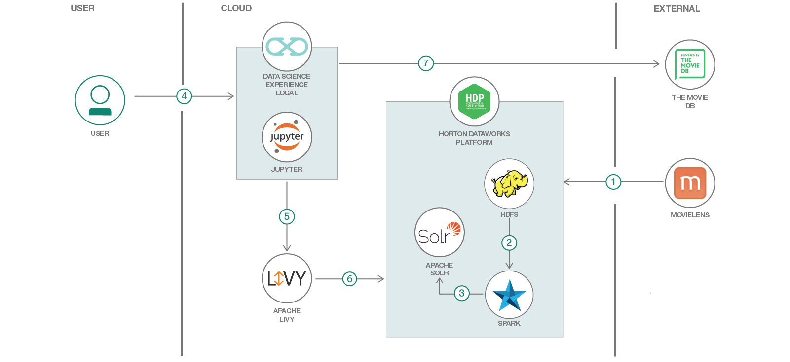
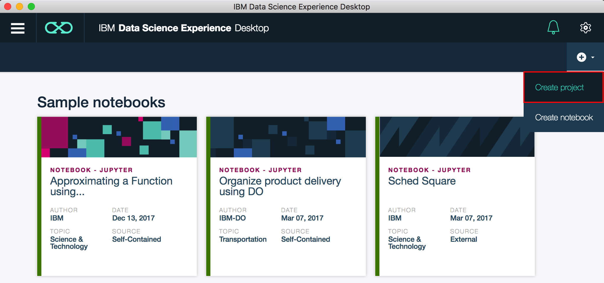
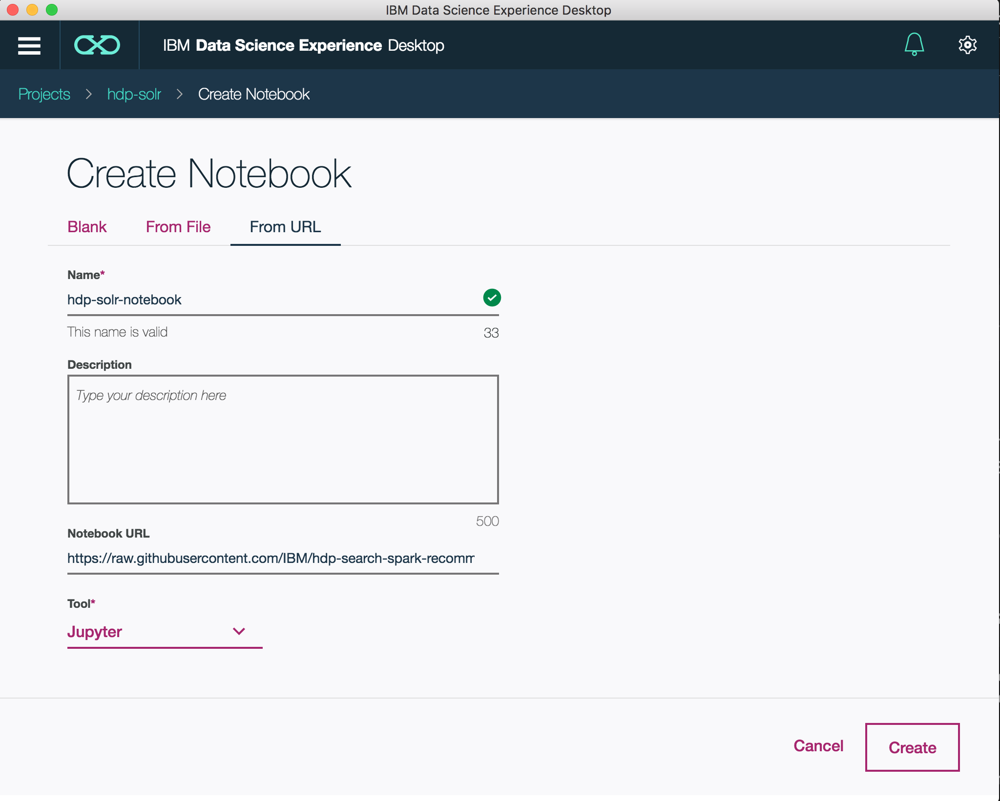
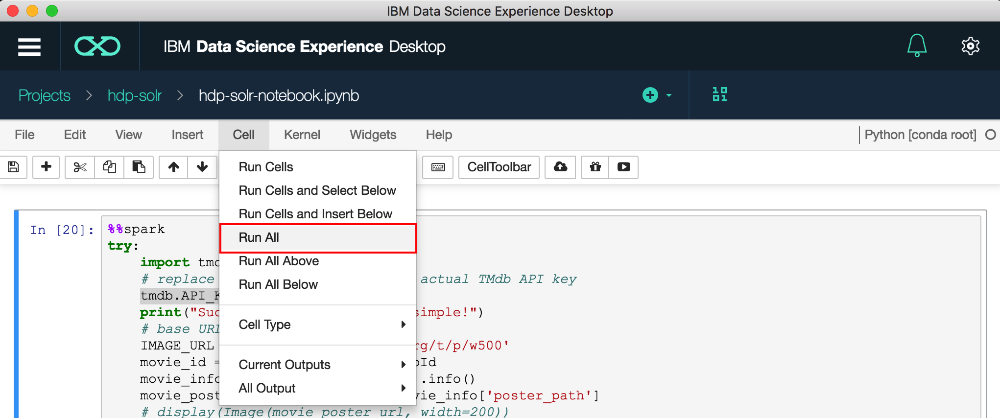

# Building a Recommender using Data Science Experience Local and HortonWorks Data Platform

Recommendation engines are one of the most well known, widely used and highest value use cases for applying machine learning. Despite this, while there are many resources available for the basics of training a recommendation model, there are relatively few that explain how to actually deploy these models to create a large-scale recommender system.

This Code Pattern demonstrates the key elements of creating such a system by using Apache Spark and HDP Search (Solr). Note that this code pattern is a port of Nick Pentreath's [Recommender built with Elasticsearch and Apache Spark](https://github.com/IBM/elasticsearch-spark-recommender), but with a focus on using HortonWorks Data Platform (HDP) and IBM's Data Science Experience Local (DSX Local).

> **What is HDP and HDP Search?** HortonWorks Data Platform (HDP) is a massively scalable platform for storing, processing and analyzing large volumes of data. HDP consists of the essential set of Apache Hadoop projects including MapReduce, Hadoop Distributed File System (HDFS), HCatalog, Pig, Hive, HBase, Zookeeper and Ambari. HDP Search provides applications and tools for indexing content from your HDP cluster to Solr (an open source enterprise search platform).

  

   *Hortonworks Data Platform by [Hortonworks](https://hortonworks.com/products/data-platforms/hdp/)*

> **What is DSX Local?** DSX Local is an on premises solution for data scientists and data engineers. It offers a suite of data science tools that integrate with RStudio, Spark, Jupyter, and Zeppelin notebook technologies. And yes, it can be configured to use HDP, too.

This repo contains a Jupyter notebook illustrating how to use Spark for training a collaborative filtering recommendation model from ratings data stored in Solr, saving the model factors to Solr, and then using Solr to serve real-time recommendations using the model. The data you will use comes from [MovieLens](https://grouplens.org/datasets/movielens/) and is a common benchmark dataset in the recommendations community. The data consists of a set of ratings given by users of the MovieLens movie rating system, to various movies. It also contains metadata (title and genres) for each movie.

When you have completed this Code Pattern, you will understand how to:

* Ingest and index user event data into Solr using the Solr Spark connector
* Load event data into Spark DataFrames and use Spark's machine learning library (MLlib) to train a collaborative filtering recommender model
* Export the trained model into Solr 
* Using a custom Solr plugin, compute _personalized user_ and _similar item_ recommendations and combine recommendations with search and content filtering

## Flow



1. Load the movie dataset into Spark.
2. Use Spark DataFrame operations to clean up the dataset and load it into Solr.
3. Using Spark MLlib, train a collaborative filtering recommendation model.
4. Save the resulting model into Solr.
5. Using Solr queries and a custom vector scoring plugin, generate some example recommendations. [The Movie Database](https://www.themoviedb.org/) API is used to display movie poster images for the recommended movies.

## Included components

* [IBM Data Science Experience Local](https://content-dsxlocal.mybluemix.net/docs/content/local/overview.html): An out-of-the-box on premises solution for data scientists and data engineers. It offers a suite of data science tools that integrate with RStudio, Spark, Jupyter, and Zeppelin notebook technologies.
* [Apache Spark](http://spark.apache.org/): An open-source, fast and general-purpose cluster computing system.
* [Hortonworks Data Platform (HDP)](https://hortonworks.com/products/data-platforms/hdp/): HDP is a massively scalable platform for storing, processing and analyzing large volumes of data. HDP consists of the essential set of Apache Hadoop projects including MapReduce, Hadoop Distributed File System (HDFS), HCatalog, Pig, Hive, HBase, Zookeeper and Ambari.
* [HDP Search](https://doc.lucidworks.com/lucidworks-hdpsearch/2.6/index.html): HDP Search provides applications and tools for indexing content from your HDP cluster to Solr.
* [Apache Livy](https://livy.incubator.apache.org/): Apache Livy is a service that enables easy interaction with a Spark cluster over a REST interface.
* [Jupyter Notebooks](http://jupyter.org/): An open-source web application that allows you to create and share documents that contain live code, equations, visualizations and explanatory text.

## Featured technologies

* [Artificial Intelligence](https://medium.com/ibm-data-science-experience): Artificial intelligence can be applied to disparate solution spaces to deliver disruptive technologies.
* [Python](https://www.python.org/): Python is a programming language that lets you work more quickly and integrate your systems more effectively.

# Steps
Follow these steps to create the required services and run the notebook locally.

1. [Setup HDP platform](#1-set-up-hdp-platform)
2. [Setup HDP Search](#2-set-up-hdp-search)
3. [Setup DSX Desktop](#3-set-up-dsx-desktop)
4. [Download the Solr Spark connector](#5-download-the-solr-spark-connector)
5. [Clone the repo](#6-clone-the-repo)
6. [Download and move the data to HDFS](#7-download-and-move-the-data-to-hdfs)
7. [Setup python plugins](#8-setup-python-plugins)
8. [Launch the notebook](#9-launch-the-notebook)
9. [Run the notebook](#10-run-the-notebook)

### 1. Setup HDP platform

Please install HDP v2.6.4 by following instructions at [install_hdp](https://docs.hortonworks.com/HDPDocuments/HDP2/HDP-2.6.4/bk_command-line-installation/content/ch_getting_ready_chapter.html) to install and setup HDP cluster. 

After you finish installing HDP v2.6.4, you need to disable livy server's CSRF protection: go to your Ambari server UI, click the `Spark2` on the left side panel, click the 'Configs' on the top, click on the `Advanced livy2-conf`
change the variable `livy.server.csrf_protection.enable` from true to false, then restart the server.

  
 
Since the code pattern makes sure of several python plugins (tmdbsimple, solrcloudpy, simplejson, Solr vector scoring plugin) and spark extension through solr spark connector, we strongly recommend that the components are at the right version for the pattern to run smoothly. 
	
	1. HDP is at v2.6.4
	1. Python version is at 2.7
	1. Spark version is at 2.2

### 2. Set up HDP Search

To install HDP Search, follow the [HDP Search instructions](https://docs.hortonworks.com/HDPDocuments/HDP2/HDP-2.6.4/bk_solr-search-installation/content/hdp-search30-install-mpack.html). This code pattern was tested with Solar v6.6.2 and assumes that Solr is started in cloud mode. Minimally, this can be accomplished by performing the following steps:

1. After installing HDP Search (Solr), verify that the server is running by performing one of the two methods.

   1. Access the Solr admin dashboard:
      ```
      http://solr_host:8983/solr
      ```

      OR

   1. Run the `solr status` command:
      ```
      cd <solr_installation_dir>/solr/bin
      ./solr status
      ```

1. The last step is to install the [Solr vector scoring plugin](https://github.com/saaay71/solr-vector-scoring). Please follow the installation instructions on the page to install the plugin.

1. Finally, restart the Ambari server one last time.

    ```
    ambari-server restart
    ```


### 3. Setup DSX Desktop 

This code pattern was tested using [DSX Desktop](https://www.ibm.com/products/data-science-experience), a lightweight version of DSX Local intended for standalone use and optimized for local development. For information on how to do that, see the [DSX Desktop Install Docs](https://content-dsxdesktop.mybluemix.net/docs/content/desktop/install.html). 

For production deployments it is recommended to use DSX Local with a three node configuration. For information on how to do that, see the [DSX Install Docs](https://content-dsxlocal.mybluemix.net/docs/content/local/welcome.html).

When you install the Notebooks, please choose Anaconda(Python 2.7) for the Jupyter Notebook.
     
  

### 4. Download the Solr Spark connector

This code pattern reads the movie data set and computes the model vectors using Spark. The Spark dataframes representing the movie data set and model vectors are then written to Solr by using the Solr Spark connector. The Solr connector for Spark can be downloaded from [Lucidworks' Spark-Solr repo](https://github.com/lucidworks/spark-solr).

> This code pattern was tested with version 3.3.3 of the connector. The Spark configurations need to be changed to add the connector jars in the Spark driver and executor classpath. This can be done via by following the steps below.

   1. Log into Ambari
   2. Select spark2 component
   3. Choose configuration tab and add the following property keys under "Custom spark2-defaults"
      * `spark.driver.extraClassPath` -> Path to the spark solr connector jar.
        Example: `spark.driver.extraClassPath` -> `/home/user1/spark-solr-3.3.3-shaded.jar`
      * `spark.executor.extraClassPath` -> Path to the spark solr connector jar
      * `spark.jars` -> Path to the spark solr connector jar

> Note: In the example above, the path is a local system path. In case of a multi node HDP cluster, please make sure that this jar is available under same path in all the nodes. Another option is to put the jar in HDFS and specify the HDFS location.

### 5. Clone the repo

Now that our HDP and DSX Local installation is complete, we can proceed with making the two communicate with each other. We start by cloning the `hdp-search-spark-recommender` repository locally. In a terminal, run the following command:

```
git clone https://github.com/IBM/hdp-search-spark-recommender.git
```

### 6. Download and move the data to HDFS

In this code pattern we will be using the [Movielens dataset](https://grouplens.org/datasets/movielens/), it contains ratings given by a set of users for movies, as well as movie metadata. For the purpose of this code pattern, we can download the ["latest small" version](http://files.grouplens.org/datasets/movielens/ml-latest-small.zip) of the data set.

Run the following commands from the base directory of the code pattern repository to download the data:

```
cd data
wget http://files.grouplens.org/datasets/movielens/ml-latest-small.zip
unzip ml-latest-small.zip
```

This code pattern is targeted to run against a multi node HDP cluster. Therefore the dataset needs to be moved to HDFS. Move the data
to HDFS by issuing the following command:

```
hadoop fs -put
```

### 7. Setup python plugins

This code pattern relies upon a few python plugins for everything to work together. Some plugins are required to be installed in the node where DSX Local is installed and the others need to be installed in all the HDP compute nodes. The following table describes the details where these plugins are to be installed.

| Library | Install Location |
| ------------- | ------------- |
| tmdbsimple | DSX Local Node |
| IPython  | Need to be installed on DSX Local node |
| paramiko | All nodes of HDP cluster | 
| numpy | All nodes of HDP cluster |
| simplejson | DSX Local and all nodes of HDP cluster |
| urllib2 | DSX Local and all nodes of HDP cluster |
| solrcloudpy | DSX Local and all nodes of HDP cluster |

The plugins can be installed using the pip command:

```
pip install numpy
```

> Note: Some of the plugins may already be installed/present in your environment. In that case please skip that plugin and move to the next plugin in the table.

### 8. Launch the notebook

> The notebook provided in this repo should work with Python 2.7.x or 3.x (and has been tested on 2.7.11 and 3.6.1)

To run the notebook you will need to start DSX Local. Below are the steps that need to be performed before running the notebook
the very first time.

1. Create a new project.

    
    

1. Create the notebook into DSX Local from the Github location.

    ```
    https://raw.githubusercontent.com/IBM/hdp-search-spark-recommender/master/notebooks/solr-hdp-spark-recommender.ipynb
    ```

    
    

1. Update the following variables in the notebook:

    * `SOLR_INSTALL_DIR`
    * `SOLR_HOST`
    * `SOLR_PORT`
    * `ZKHOST`
    * `SSHUSER`
    * `SSHPASSWORD`
    * `tmdb.API_KEY`

1. Run the notebook!

### 9. Run the notebook

When a notebook is executed, what is actually happening is that each code cell in
the notebook is executed, in order, from top to bottom.

Each code cell is selectable and is preceded by a tag in the left margin. The tag
format is `In [x]:`. Depending on the state of the notebook, the `x` can be:

* A blank, this indicates that the cell has never been executed.
* A number, this number represents the relative order this code step was executed.
* A `*`, this indicates that the cell is currently executing.

There are several ways to execute the code cells in your notebook:

* One cell at a time.
  * Select the cell, and then press the `Play` button in the toolbar. You can also hit `Shift+Enter` to execute the cell and move to the next cell.
* Batch mode, in sequential order.
  * From the `Cell` menu bar, there are several options available. For example, you
    can `Run All` cells in your notebook, or you can `Run All Below`, that will
    start executing from the first cell under the currently selected cell, and then
    continue executing all cells that follow.



# Sample output

After classifying the data by movies, ratings and genres, we train our recommender model. 


After loading our model into Solr, we can predict which movies people will like based on ratings of similar movies in the same genre.


The example output in the [data/examples](data/examples) folder shows the output of the notebook after running it in full. View it [here](data/examples/solr-hdp-spark-recommender.ipynb).

# Troubleshooting

* Error: `Should DSX Desktop fail to respond at any time.`
  > Solution: Perform the following steps:

    	* Close IBM DSX desktop
    	* Kill all the processes related to DSX Local from terminal:

      	```
    	docker ps |grep dsx
    	docker rm -f <container id>
    	```

  	* Remove DSX Desktop metadata

    	```
    	cd ~/Library/Application \Support/
    	rm -rf ibm-dsx-desktop
    	```

  	* Restart DSX Desktop
  	* Load the jupyter notebook again

* Error: `Missing Required Header for CSRF protection.`

	
   If you see this error when trying to create spark session through livy(the cell below), it means that you need to diable the CSRF in the livy property.   
   ```
   livyURL="http://host name:8999"
   %spark add -s spark -l python -u $livyURL
   ``` 

  > Solution: Go to the setup Step1, follow the step to disable livy's livy.server.csrf_protection.enable property.

* Error: `404 Client Error: Not Found for url: http://your hostname:8983/solr/ratings/schema`
 
	If you see this error when running this cell
  	```
  	%%spark
  	setupSchema()
  	conn = SolrConnection(SOLR_HOST_PORT, version="6.6.0")
  	```
  
 	go to Solr's UI, and click the "Logging" on the left side, and check the latest logs, if showing
  
  	Error: `org.apache.solr.common.SolrException: Error CREATEing SolrCore 'movies_vector_shard1_replica1': Unable to create core [movies_vector_shard1_replica1] Caused by: /solr/movies_vector/core_node    1/data/index/write.lock for client 172.17.0.2 already exists`
  
  > Solution: Find your solr data/index directory which is specified in conf/solrconfig.xml, delete only the write.log in data/index folder.

  
# Links

* [Teaming on Data: IBM and Hortonworks Broaden Relationship](https://hortonworks.com/blog/teaming-data-ibm-hortonworks-broaden-relationship/)
* [Certification of IBM Data Science Experience (DSX) on HDP is a Win-Win for Customers](https://hortonworks.com/blog/certification-ibm-data-science-experience-dsx-hdp-win-win-customers/)
* [An Exciting Data Science Experience on HDP](https://hortonworks.com/blog/exciting-data-science-experience-hdp/)

# Learn more

* **Data Analytics Code Patterns**: Enjoyed this Code Pattern? Check out our other [Data Analytics Code Patterns](https://developer.ibm.com/code/technologies/data-science/)
* **AI and Data Code Pattern Playlist**: Bookmark our [playlist](https://www.youtube.com/playlist?list=PLzUbsvIyrNfknNewObx5N7uGZ5FKH0Fde) with all of our Code Pattern videos
* **Watson Studio**: Master the art of data science with IBM's [Watson Studio](https://datascience.ibm.com/)
* **Spark on IBM Cloud**: Need a Spark cluster? Create up to 30 Spark executors on IBM Cloud with our [Spark service](https://console.bluemix.net/catalog/services/apache-spark)

# License
[Apache 2.0](LICENSE)
